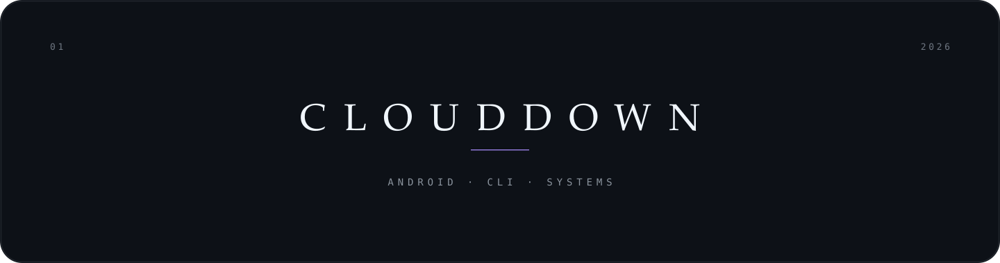

  

 

  

    Android apps, command-line tools, small systems. 
    Kotlin, Python, and Rust.
  

  

    internships 2027+&nbsp;&nbsp;·&nbsp;&nbsp;open source
  

 

---

 

<h3 align="center">work</h3>

  <a href="https://github.com/CloudDown/dispo"><strong>dispo</strong></a> — availability · android 
  <a href="https://github.com/CloudDown/quest"><strong>quest</strong></a> — daily quests · android 
  <a href="https://github.com/CloudDown/annie"><strong>annie</strong></a> — nyaa · fzf · libtorrent 
  <a href="https://github.com/CloudDown/instree"><strong>instree</strong></a> — instagram tracker

 

<h3 align="center">stack</h3>

  <code>kotlin</code>&nbsp;
  <code>python</code>&nbsp;
  <code>rust</code>&nbsp;
  <code>java</code>&nbsp;
  <code>javascript</code>&nbsp;
  <code>bash</code>
    
  <code>linux</code>&nbsp;
  <code>docker</code>&nbsp;
  <code>git</code>&nbsp;
  <code>raspberry pi</code>

